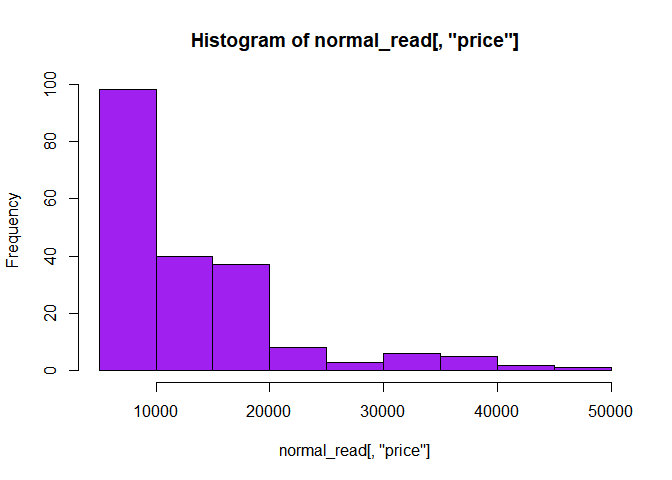

hw01-Tianran-Li
================
Grace Li (Tianran)
February 20, 2018

``` r
read.csv('imports-85.data')
```

    ##     X3  X.   alfa.romero    gas   std  two convertible rwd front X88.60
    ## 1    3   ?   alfa-romero    gas   std  two convertible rwd front   88.6
    ## 2    1   ?   alfa-romero    gas   std  two   hatchback rwd front   94.5
    ## 3    2 164          audi    gas   std four       sedan fwd front   99.8
    ## 4    2 164          audi    gas   std four       sedan 4wd front   99.4
    ## 5    2   ?          audi    gas   std  two       sedan fwd front   99.8
    ## 6    1 158          audi    gas   std four       sedan fwd front  105.8
    ## 7    1   ?          audi    gas   std four       wagon fwd front  105.8
    ## 8    1 158          audi    gas turbo four       sedan fwd front  105.8
    ## 9    0   ?          audi    gas turbo  two   hatchback 4wd front   99.5
    ## 10   2 192           bmw    gas   std  two       sedan rwd front  101.2
    ## 11   0 192           bmw    gas   std four       sedan rwd front  101.2
    ## 12   0 188           bmw    gas   std  two       sedan rwd front  101.2
    ## 13   0 188           bmw    gas   std four       sedan rwd front  101.2
    ## 14   1   ?           bmw    gas   std four       sedan rwd front  103.5
    ## 15   0   ?           bmw    gas   std four       sedan rwd front  103.5
    ## 16   0   ?           bmw    gas   std  two       sedan rwd front  103.5
    ## 17   0   ?           bmw    gas   std four       sedan rwd front  110.0
    ## 18   2 121     chevrolet    gas   std  two   hatchback fwd front   88.4
    ## 19   1  98     chevrolet    gas   std  two   hatchback fwd front   94.5
    ## 20   0  81     chevrolet    gas   std four       sedan fwd front   94.5
    ## 21   1 118         dodge    gas   std  two   hatchback fwd front   93.7
    ## 22   1 118         dodge    gas   std  two   hatchback fwd front   93.7
    ## 23   1 118         dodge    gas turbo  two   hatchback fwd front   93.7
    ## 24   1 148         dodge    gas   std four   hatchback fwd front   93.7
    ## 25   1 148         dodge    gas   std four       sedan fwd front   93.7
    ## 26   1 148         dodge    gas   std four       sedan fwd front   93.7
    ## 27   1 148         dodge    gas turbo    ?       sedan fwd front   93.7
    ## 28  -1 110         dodge    gas   std four       wagon fwd front  103.3
    ## 29   3 145         dodge    gas turbo  two   hatchback fwd front   95.9
    ## 30   2 137         honda    gas   std  two   hatchback fwd front   86.6
    ## 31   2 137         honda    gas   std  two   hatchback fwd front   86.6
    ## 32   1 101         honda    gas   std  two   hatchback fwd front   93.7
    ## 33   1 101         honda    gas   std  two   hatchback fwd front   93.7
    ## 34   1 101         honda    gas   std  two   hatchback fwd front   93.7
    ## 35   0 110         honda    gas   std four       sedan fwd front   96.5
    ## 36   0  78         honda    gas   std four       wagon fwd front   96.5
    ## 37   0 106         honda    gas   std  two   hatchback fwd front   96.5
    ## 38   0 106         honda    gas   std  two   hatchback fwd front   96.5
    ## 39   0  85         honda    gas   std four       sedan fwd front   96.5
    ## 40   0  85         honda    gas   std four       sedan fwd front   96.5
    ## 41   0  85         honda    gas   std four       sedan fwd front   96.5
    ## 42   1 107         honda    gas   std  two       sedan fwd front   96.5
    ## 43   0   ?         isuzu    gas   std four       sedan rwd front   94.3
    ## 44   1   ?         isuzu    gas   std  two       sedan fwd front   94.5
    ## 45   0   ?         isuzu    gas   std four       sedan fwd front   94.5
    ## 46   2   ?         isuzu    gas   std  two   hatchback rwd front   96.0
    ## 47   0 145        jaguar    gas   std four       sedan rwd front  113.0
    ## 48   0   ?        jaguar    gas   std four       sedan rwd front  113.0
    ## 49   0   ?        jaguar    gas   std  two       sedan rwd front  102.0
    ## 50   1 104         mazda    gas   std  two   hatchback fwd front   93.1
    ## 51   1 104         mazda    gas   std  two   hatchback fwd front   93.1
    ## 52   1 104         mazda    gas   std  two   hatchback fwd front   93.1
    ## 53   1 113         mazda    gas   std four       sedan fwd front   93.1
    ## 54   1 113         mazda    gas   std four       sedan fwd front   93.1
    ## 55   3 150         mazda    gas   std  two   hatchback rwd front   95.3
    ## 56   3 150         mazda    gas   std  two   hatchback rwd front   95.3
    ## 57   3 150         mazda    gas   std  two   hatchback rwd front   95.3
    ## 58   3 150         mazda    gas   std  two   hatchback rwd front   95.3
    ## 59   1 129         mazda    gas   std  two   hatchback fwd front   98.8
    ## 60   0 115         mazda    gas   std four       sedan fwd front   98.8
    ## 61   1 129         mazda    gas   std  two   hatchback fwd front   98.8
    ## 62   0 115         mazda    gas   std four       sedan fwd front   98.8
    ## 63   0   ?         mazda diesel   std    ?       sedan fwd front   98.8
    ## 64   0 115         mazda    gas   std four   hatchback fwd front   98.8
    ## 65   0 118         mazda    gas   std four       sedan rwd front  104.9
    ## 66   0   ?         mazda diesel   std four       sedan rwd front  104.9
    ## 67  -1  93 mercedes-benz diesel turbo four       sedan rwd front  110.0
    ## 68  -1  93 mercedes-benz diesel turbo four       wagon rwd front  110.0
    ## 69   0  93 mercedes-benz diesel turbo  two     hardtop rwd front  106.7
    ## 70  -1  93 mercedes-benz diesel turbo four       sedan rwd front  115.6
    ## 71  -1   ? mercedes-benz    gas   std four       sedan rwd front  115.6
    ## 72   3 142 mercedes-benz    gas   std  two convertible rwd front   96.6
    ## 73   0   ? mercedes-benz    gas   std four       sedan rwd front  120.9
    ## 74   1   ? mercedes-benz    gas   std  two     hardtop rwd front  112.0
    ## 75   1   ?       mercury    gas turbo  two   hatchback rwd front  102.7
    ## 76   2 161    mitsubishi    gas   std  two   hatchback fwd front   93.7
    ## 77   2 161    mitsubishi    gas   std  two   hatchback fwd front   93.7
    ## 78   2 161    mitsubishi    gas   std  two   hatchback fwd front   93.7
    ## 79   1 161    mitsubishi    gas turbo  two   hatchback fwd front   93.0
    ## 80   3 153    mitsubishi    gas turbo  two   hatchback fwd front   96.3
    ## 81   3 153    mitsubishi    gas   std  two   hatchback fwd front   96.3
    ## 82   3   ?    mitsubishi    gas turbo  two   hatchback fwd front   95.9
    ## 83   3   ?    mitsubishi    gas turbo  two   hatchback fwd front   95.9
    ## 84   3   ?    mitsubishi    gas turbo  two   hatchback fwd front   95.9
    ## 85   1 125    mitsubishi    gas   std four       sedan fwd front   96.3
    ## 86   1 125    mitsubishi    gas   std four       sedan fwd front   96.3
    ## 87   1 125    mitsubishi    gas turbo four       sedan fwd front   96.3
    ## 88  -1 137    mitsubishi    gas   std four       sedan fwd front   96.3
    ## 89   1 128        nissan    gas   std  two       sedan fwd front   94.5
    ## 90   1 128        nissan diesel   std  two       sedan fwd front   94.5
    ## 91   1 128        nissan    gas   std  two       sedan fwd front   94.5
    ## 92   1 122        nissan    gas   std four       sedan fwd front   94.5
    ## 93   1 103        nissan    gas   std four       wagon fwd front   94.5
    ## 94   1 128        nissan    gas   std  two       sedan fwd front   94.5
    ## 95   1 128        nissan    gas   std  two   hatchback fwd front   94.5
    ## 96   1 122        nissan    gas   std four       sedan fwd front   94.5
    ## 97   1 103        nissan    gas   std four       wagon fwd front   94.5
    ## 98   2 168        nissan    gas   std  two     hardtop fwd front   95.1
    ## 99   0 106        nissan    gas   std four   hatchback fwd front   97.2
    ## 100  0 106        nissan    gas   std four       sedan fwd front   97.2
    ## 101  0 128        nissan    gas   std four       sedan fwd front  100.4
    ## 102  0 108        nissan    gas   std four       wagon fwd front  100.4
    ## 103  0 108        nissan    gas   std four       sedan fwd front  100.4
    ## 104  3 194        nissan    gas   std  two   hatchback rwd front   91.3
    ## 105  3 194        nissan    gas turbo  two   hatchback rwd front   91.3
    ## 106  1 231        nissan    gas   std  two   hatchback rwd front   99.2
    ## 107  0 161        peugot    gas   std four       sedan rwd front  107.9
    ## 108  0 161        peugot diesel turbo four       sedan rwd front  107.9
    ## 109  0   ?        peugot    gas   std four       wagon rwd front  114.2
    ## 110  0   ?        peugot diesel turbo four       wagon rwd front  114.2
    ## 111  0 161        peugot    gas   std four       sedan rwd front  107.9
    ## 112  0 161        peugot diesel turbo four       sedan rwd front  107.9
    ## 113  0   ?        peugot    gas   std four       wagon rwd front  114.2
    ## 114  0   ?        peugot diesel turbo four       wagon rwd front  114.2
    ## 115  0 161        peugot    gas   std four       sedan rwd front  107.9
    ## 116  0 161        peugot diesel turbo four       sedan rwd front  107.9
    ## 117  0 161        peugot    gas turbo four       sedan rwd front  108.0
    ## 118  1 119      plymouth    gas   std  two   hatchback fwd front   93.7
    ## 119  1 119      plymouth    gas turbo  two   hatchback fwd front   93.7
    ## 120  1 154      plymouth    gas   std four   hatchback fwd front   93.7
    ## 121  1 154      plymouth    gas   std four       sedan fwd front   93.7
    ## 122  1 154      plymouth    gas   std four       sedan fwd front   93.7
    ## 123 -1  74      plymouth    gas   std four       wagon fwd front  103.3
    ## 124  3   ?      plymouth    gas turbo  two   hatchback rwd front   95.9
    ## 125  3 186       porsche    gas   std  two   hatchback rwd front   94.5
    ## 126  3   ?       porsche    gas   std  two     hardtop rwd  rear   89.5
    ## 127  3   ?       porsche    gas   std  two     hardtop rwd  rear   89.5
    ## 128  3   ?       porsche    gas   std  two convertible rwd  rear   89.5
    ## 129  1   ?       porsche    gas   std  two   hatchback rwd front   98.4
    ## 130  0   ?       renault    gas   std four       wagon fwd front   96.1
    ## 131  2   ?       renault    gas   std  two   hatchback fwd front   96.1
    ## 132  3 150          saab    gas   std  two   hatchback fwd front   99.1
    ## 133  2 104          saab    gas   std four       sedan fwd front   99.1
    ## 134  3 150          saab    gas   std  two   hatchback fwd front   99.1
    ## 135  2 104          saab    gas   std four       sedan fwd front   99.1
    ## 136  3 150          saab    gas turbo  two   hatchback fwd front   99.1
    ## 137  2 104          saab    gas turbo four       sedan fwd front   99.1
    ## 138  2  83        subaru    gas   std  two   hatchback fwd front   93.7
    ## 139  2  83        subaru    gas   std  two   hatchback fwd front   93.7
    ## 140  2  83        subaru    gas   std  two   hatchback 4wd front   93.3
    ## 141  0 102        subaru    gas   std four       sedan fwd front   97.2
    ## 142  0 102        subaru    gas   std four       sedan fwd front   97.2
    ## 143  0 102        subaru    gas   std four       sedan fwd front   97.2
    ## 144  0 102        subaru    gas   std four       sedan 4wd front   97.0
    ## 145  0 102        subaru    gas turbo four       sedan 4wd front   97.0
    ## 146  0  89        subaru    gas   std four       wagon fwd front   97.0
    ## 147  0  89        subaru    gas   std four       wagon fwd front   97.0
    ## 148  0  85        subaru    gas   std four       wagon 4wd front   96.9
    ## 149  0  85        subaru    gas turbo four       wagon 4wd front   96.9
    ## 150  1  87        toyota    gas   std  two   hatchback fwd front   95.7
    ## 151  1  87        toyota    gas   std  two   hatchback fwd front   95.7
    ## 152  1  74        toyota    gas   std four   hatchback fwd front   95.7
    ## 153  0  77        toyota    gas   std four       wagon fwd front   95.7
    ## 154  0  81        toyota    gas   std four       wagon 4wd front   95.7
    ## 155  0  91        toyota    gas   std four       wagon 4wd front   95.7
    ## 156  0  91        toyota    gas   std four       sedan fwd front   95.7
    ## 157  0  91        toyota    gas   std four   hatchback fwd front   95.7
    ## 158  0  91        toyota diesel   std four       sedan fwd front   95.7
    ## 159  0  91        toyota diesel   std four   hatchback fwd front   95.7
    ## 160  0  91        toyota    gas   std four       sedan fwd front   95.7
    ## 161  0  91        toyota    gas   std four   hatchback fwd front   95.7
    ## 162  0  91        toyota    gas   std four       sedan fwd front   95.7
    ## 163  1 168        toyota    gas   std  two       sedan rwd front   94.5
    ## 164  1 168        toyota    gas   std  two   hatchback rwd front   94.5
    ## 165  1 168        toyota    gas   std  two       sedan rwd front   94.5
    ## 166  1 168        toyota    gas   std  two   hatchback rwd front   94.5
    ## 167  2 134        toyota    gas   std  two     hardtop rwd front   98.4
    ## 168  2 134        toyota    gas   std  two     hardtop rwd front   98.4
    ## 169  2 134        toyota    gas   std  two   hatchback rwd front   98.4
    ## 170  2 134        toyota    gas   std  two     hardtop rwd front   98.4
    ## 171  2 134        toyota    gas   std  two   hatchback rwd front   98.4
    ## 172  2 134        toyota    gas   std  two convertible rwd front   98.4
    ## 173 -1  65        toyota    gas   std four       sedan fwd front  102.4
    ## 174 -1  65        toyota diesel turbo four       sedan fwd front  102.4
    ## 175 -1  65        toyota    gas   std four   hatchback fwd front  102.4
    ## 176 -1  65        toyota    gas   std four       sedan fwd front  102.4
    ## 177 -1  65        toyota    gas   std four   hatchback fwd front  102.4
    ## 178  3 197        toyota    gas   std  two   hatchback rwd front  102.9
    ## 179  3 197        toyota    gas   std  two   hatchback rwd front  102.9
    ## 180 -1  90        toyota    gas   std four       sedan rwd front  104.5
    ## 181 -1   ?        toyota    gas   std four       wagon rwd front  104.5
    ## 182  2 122    volkswagen diesel   std  two       sedan fwd front   97.3
    ## 183  2 122    volkswagen    gas   std  two       sedan fwd front   97.3
    ## 184  2  94    volkswagen diesel   std four       sedan fwd front   97.3
    ## 185  2  94    volkswagen    gas   std four       sedan fwd front   97.3
    ## 186  2  94    volkswagen    gas   std four       sedan fwd front   97.3
    ## 187  2  94    volkswagen diesel turbo four       sedan fwd front   97.3
    ## 188  2  94    volkswagen    gas   std four       sedan fwd front   97.3
    ## 189  3   ?    volkswagen    gas   std  two convertible fwd front   94.5
    ## 190  3 256    volkswagen    gas   std  two   hatchback fwd front   94.5
    ## 191  0   ?    volkswagen    gas   std four       sedan fwd front  100.4
    ## 192  0   ?    volkswagen diesel turbo four       sedan fwd front  100.4
    ## 193  0   ?    volkswagen    gas   std four       wagon fwd front  100.4
    ## 194 -2 103         volvo    gas   std four       sedan rwd front  104.3
    ## 195 -1  74         volvo    gas   std four       wagon rwd front  104.3
    ## 196 -2 103         volvo    gas   std four       sedan rwd front  104.3
    ## 197 -1  74         volvo    gas   std four       wagon rwd front  104.3
    ## 198 -2 103         volvo    gas turbo four       sedan rwd front  104.3
    ## 199 -1  74         volvo    gas turbo four       wagon rwd front  104.3
    ## 200 -1  95         volvo    gas   std four       sedan rwd front  109.1
    ## 201 -1  95         volvo    gas turbo four       sedan rwd front  109.1
    ## 202 -1  95         volvo    gas   std four       sedan rwd front  109.1
    ## 203 -1  95         volvo diesel turbo four       sedan rwd front  109.1
    ## 204 -1  95         volvo    gas turbo four       sedan rwd front  109.1
    ##     X168.80 X64.10 X48.80 X2548  dohc   four X130 mpfi X3.47 X2.68 X9.00
    ## 1     168.8   64.1   48.8  2548  dohc   four  130 mpfi  3.47  2.68  9.00
    ## 2     171.2   65.5   52.4  2823  ohcv    six  152 mpfi  2.68  3.47  9.00
    ## 3     176.6   66.2   54.3  2337   ohc   four  109 mpfi  3.19  3.40 10.00
    ## 4     176.6   66.4   54.3  2824   ohc   five  136 mpfi  3.19  3.40  8.00
    ## 5     177.3   66.3   53.1  2507   ohc   five  136 mpfi  3.19  3.40  8.50
    ## 6     192.7   71.4   55.7  2844   ohc   five  136 mpfi  3.19  3.40  8.50
    ## 7     192.7   71.4   55.7  2954   ohc   five  136 mpfi  3.19  3.40  8.50
    ## 8     192.7   71.4   55.9  3086   ohc   five  131 mpfi  3.13  3.40  8.30
    ## 9     178.2   67.9   52.0  3053   ohc   five  131 mpfi  3.13  3.40  7.00
    ## 10    176.8   64.8   54.3  2395   ohc   four  108 mpfi  3.50  2.80  8.80
    ## 11    176.8   64.8   54.3  2395   ohc   four  108 mpfi  3.50  2.80  8.80
    ## 12    176.8   64.8   54.3  2710   ohc    six  164 mpfi  3.31  3.19  9.00
    ## 13    176.8   64.8   54.3  2765   ohc    six  164 mpfi  3.31  3.19  9.00
    ## 14    189.0   66.9   55.7  3055   ohc    six  164 mpfi  3.31  3.19  9.00
    ## 15    189.0   66.9   55.7  3230   ohc    six  209 mpfi  3.62  3.39  8.00
    ## 16    193.8   67.9   53.7  3380   ohc    six  209 mpfi  3.62  3.39  8.00
    ## 17    197.0   70.9   56.3  3505   ohc    six  209 mpfi  3.62  3.39  8.00
    ## 18    141.1   60.3   53.2  1488     l  three   61 2bbl  2.91  3.03  9.50
    ## 19    155.9   63.6   52.0  1874   ohc   four   90 2bbl  3.03  3.11  9.60
    ## 20    158.8   63.6   52.0  1909   ohc   four   90 2bbl  3.03  3.11  9.60
    ## 21    157.3   63.8   50.8  1876   ohc   four   90 2bbl  2.97  3.23  9.41
    ## 22    157.3   63.8   50.8  1876   ohc   four   90 2bbl  2.97  3.23  9.40
    ## 23    157.3   63.8   50.8  2128   ohc   four   98 mpfi  3.03  3.39  7.60
    ## 24    157.3   63.8   50.6  1967   ohc   four   90 2bbl  2.97  3.23  9.40
    ## 25    157.3   63.8   50.6  1989   ohc   four   90 2bbl  2.97  3.23  9.40
    ## 26    157.3   63.8   50.6  1989   ohc   four   90 2bbl  2.97  3.23  9.40
    ## 27    157.3   63.8   50.6  2191   ohc   four   98 mpfi  3.03  3.39  7.60
    ## 28    174.6   64.6   59.8  2535   ohc   four  122 2bbl  3.34  3.46  8.50
    ## 29    173.2   66.3   50.2  2811   ohc   four  156  mfi  3.60  3.90  7.00
    ## 30    144.6   63.9   50.8  1713   ohc   four   92 1bbl  2.91  3.41  9.60
    ## 31    144.6   63.9   50.8  1819   ohc   four   92 1bbl  2.91  3.41  9.20
    ## 32    150.0   64.0   52.6  1837   ohc   four   79 1bbl  2.91  3.07 10.10
    ## 33    150.0   64.0   52.6  1940   ohc   four   92 1bbl  2.91  3.41  9.20
    ## 34    150.0   64.0   52.6  1956   ohc   four   92 1bbl  2.91  3.41  9.20
    ## 35    163.4   64.0   54.5  2010   ohc   four   92 1bbl  2.91  3.41  9.20
    ## 36    157.1   63.9   58.3  2024   ohc   four   92 1bbl  2.92  3.41  9.20
    ## 37    167.5   65.2   53.3  2236   ohc   four  110 1bbl  3.15  3.58  9.00
    ## 38    167.5   65.2   53.3  2289   ohc   four  110 1bbl  3.15  3.58  9.00
    ## 39    175.4   65.2   54.1  2304   ohc   four  110 1bbl  3.15  3.58  9.00
    ## 40    175.4   62.5   54.1  2372   ohc   four  110 1bbl  3.15  3.58  9.00
    ## 41    175.4   65.2   54.1  2465   ohc   four  110 mpfi  3.15  3.58  9.00
    ## 42    169.1   66.0   51.0  2293   ohc   four  110 2bbl  3.15  3.58  9.10
    ## 43    170.7   61.8   53.5  2337   ohc   four  111 2bbl  3.31  3.23  8.50
    ## 44    155.9   63.6   52.0  1874   ohc   four   90 2bbl  3.03  3.11  9.60
    ## 45    155.9   63.6   52.0  1909   ohc   four   90 2bbl  3.03  3.11  9.60
    ## 46    172.6   65.2   51.4  2734   ohc   four  119 spfi  3.43  3.23  9.20
    ## 47    199.6   69.6   52.8  4066  dohc    six  258 mpfi  3.63  4.17  8.10
    ## 48    199.6   69.6   52.8  4066  dohc    six  258 mpfi  3.63  4.17  8.10
    ## 49    191.7   70.6   47.8  3950  ohcv twelve  326 mpfi  3.54  2.76 11.50
    ## 50    159.1   64.2   54.1  1890   ohc   four   91 2bbl  3.03  3.15  9.00
    ## 51    159.1   64.2   54.1  1900   ohc   four   91 2bbl  3.03  3.15  9.00
    ## 52    159.1   64.2   54.1  1905   ohc   four   91 2bbl  3.03  3.15  9.00
    ## 53    166.8   64.2   54.1  1945   ohc   four   91 2bbl  3.03  3.15  9.00
    ## 54    166.8   64.2   54.1  1950   ohc   four   91 2bbl  3.08  3.15  9.00
    ## 55    169.0   65.7   49.6  2380 rotor    two   70 4bbl     ?     ?  9.40
    ## 56    169.0   65.7   49.6  2380 rotor    two   70 4bbl     ?     ?  9.40
    ## 57    169.0   65.7   49.6  2385 rotor    two   70 4bbl     ?     ?  9.40
    ## 58    169.0   65.7   49.6  2500 rotor    two   80 mpfi     ?     ?  9.40
    ## 59    177.8   66.5   53.7  2385   ohc   four  122 2bbl  3.39  3.39  8.60
    ## 60    177.8   66.5   55.5  2410   ohc   four  122 2bbl  3.39  3.39  8.60
    ## 61    177.8   66.5   53.7  2385   ohc   four  122 2bbl  3.39  3.39  8.60
    ## 62    177.8   66.5   55.5  2410   ohc   four  122 2bbl  3.39  3.39  8.60
    ## 63    177.8   66.5   55.5  2443   ohc   four  122  idi  3.39  3.39 22.70
    ## 64    177.8   66.5   55.5  2425   ohc   four  122 2bbl  3.39  3.39  8.60
    ## 65    175.0   66.1   54.4  2670   ohc   four  140 mpfi  3.76  3.16  8.00
    ## 66    175.0   66.1   54.4  2700   ohc   four  134  idi  3.43  3.64 22.00
    ## 67    190.9   70.3   56.5  3515   ohc   five  183  idi  3.58  3.64 21.50
    ## 68    190.9   70.3   58.7  3750   ohc   five  183  idi  3.58  3.64 21.50
    ## 69    187.5   70.3   54.9  3495   ohc   five  183  idi  3.58  3.64 21.50
    ## 70    202.6   71.7   56.3  3770   ohc   five  183  idi  3.58  3.64 21.50
    ## 71    202.6   71.7   56.5  3740  ohcv  eight  234 mpfi  3.46  3.10  8.30
    ## 72    180.3   70.5   50.8  3685  ohcv  eight  234 mpfi  3.46  3.10  8.30
    ## 73    208.1   71.7   56.7  3900  ohcv  eight  308 mpfi  3.80  3.35  8.00
    ## 74    199.2   72.0   55.4  3715  ohcv  eight  304 mpfi  3.80  3.35  8.00
    ## 75    178.4   68.0   54.8  2910   ohc   four  140 mpfi  3.78  3.12  8.00
    ## 76    157.3   64.4   50.8  1918   ohc   four   92 2bbl  2.97  3.23  9.40
    ## 77    157.3   64.4   50.8  1944   ohc   four   92 2bbl  2.97  3.23  9.40
    ## 78    157.3   64.4   50.8  2004   ohc   four   92 2bbl  2.97  3.23  9.40
    ## 79    157.3   63.8   50.8  2145   ohc   four   98 spdi  3.03  3.39  7.60
    ## 80    173.0   65.4   49.4  2370   ohc   four  110 spdi  3.17  3.46  7.50
    ## 81    173.0   65.4   49.4  2328   ohc   four  122 2bbl  3.35  3.46  8.50
    ## 82    173.2   66.3   50.2  2833   ohc   four  156 spdi  3.58  3.86  7.00
    ## 83    173.2   66.3   50.2  2921   ohc   four  156 spdi  3.59  3.86  7.00
    ## 84    173.2   66.3   50.2  2926   ohc   four  156 spdi  3.59  3.86  7.00
    ## 85    172.4   65.4   51.6  2365   ohc   four  122 2bbl  3.35  3.46  8.50
    ## 86    172.4   65.4   51.6  2405   ohc   four  122 2bbl  3.35  3.46  8.50
    ## 87    172.4   65.4   51.6  2403   ohc   four  110 spdi  3.17  3.46  7.50
    ## 88    172.4   65.4   51.6  2403   ohc   four  110 spdi  3.17  3.46  7.50
    ## 89    165.3   63.8   54.5  1889   ohc   four   97 2bbl  3.15  3.29  9.40
    ## 90    165.3   63.8   54.5  2017   ohc   four  103  idi  2.99  3.47 21.90
    ## 91    165.3   63.8   54.5  1918   ohc   four   97 2bbl  3.15  3.29  9.40
    ## 92    165.3   63.8   54.5  1938   ohc   four   97 2bbl  3.15  3.29  9.40
    ## 93    170.2   63.8   53.5  2024   ohc   four   97 2bbl  3.15  3.29  9.40
    ## 94    165.3   63.8   54.5  1951   ohc   four   97 2bbl  3.15  3.29  9.40
    ## 95    165.6   63.8   53.3  2028   ohc   four   97 2bbl  3.15  3.29  9.40
    ## 96    165.3   63.8   54.5  1971   ohc   four   97 2bbl  3.15  3.29  9.40
    ## 97    170.2   63.8   53.5  2037   ohc   four   97 2bbl  3.15  3.29  9.40
    ## 98    162.4   63.8   53.3  2008   ohc   four   97 2bbl  3.15  3.29  9.40
    ## 99    173.4   65.2   54.7  2324   ohc   four  120 2bbl  3.33  3.47  8.50
    ## 100   173.4   65.2   54.7  2302   ohc   four  120 2bbl  3.33  3.47  8.50
    ## 101   181.7   66.5   55.1  3095  ohcv    six  181 mpfi  3.43  3.27  9.00
    ## 102   184.6   66.5   56.1  3296  ohcv    six  181 mpfi  3.43  3.27  9.00
    ## 103   184.6   66.5   55.1  3060  ohcv    six  181 mpfi  3.43  3.27  9.00
    ## 104   170.7   67.9   49.7  3071  ohcv    six  181 mpfi  3.43  3.27  9.00
    ## 105   170.7   67.9   49.7  3139  ohcv    six  181 mpfi  3.43  3.27  7.80
    ## 106   178.5   67.9   49.7  3139  ohcv    six  181 mpfi  3.43  3.27  9.00
    ## 107   186.7   68.4   56.7  3020     l   four  120 mpfi  3.46  3.19  8.40
    ## 108   186.7   68.4   56.7  3197     l   four  152  idi  3.70  3.52 21.00
    ## 109   198.9   68.4   58.7  3230     l   four  120 mpfi  3.46  3.19  8.40
    ## 110   198.9   68.4   58.7  3430     l   four  152  idi  3.70  3.52 21.00
    ## 111   186.7   68.4   56.7  3075     l   four  120 mpfi  3.46  2.19  8.40
    ## 112   186.7   68.4   56.7  3252     l   four  152  idi  3.70  3.52 21.00
    ## 113   198.9   68.4   56.7  3285     l   four  120 mpfi  3.46  2.19  8.40
    ## 114   198.9   68.4   58.7  3485     l   four  152  idi  3.70  3.52 21.00
    ## 115   186.7   68.4   56.7  3075     l   four  120 mpfi  3.46  3.19  8.40
    ## 116   186.7   68.4   56.7  3252     l   four  152  idi  3.70  3.52 21.00
    ## 117   186.7   68.3   56.0  3130     l   four  134 mpfi  3.61  3.21  7.00
    ## 118   157.3   63.8   50.8  1918   ohc   four   90 2bbl  2.97  3.23  9.40
    ## 119   157.3   63.8   50.8  2128   ohc   four   98 spdi  3.03  3.39  7.60
    ## 120   157.3   63.8   50.6  1967   ohc   four   90 2bbl  2.97  3.23  9.40
    ## 121   167.3   63.8   50.8  1989   ohc   four   90 2bbl  2.97  3.23  9.40
    ## 122   167.3   63.8   50.8  2191   ohc   four   98 2bbl  2.97  3.23  9.40
    ## 123   174.6   64.6   59.8  2535   ohc   four  122 2bbl  3.35  3.46  8.50
    ## 124   173.2   66.3   50.2  2818   ohc   four  156 spdi  3.59  3.86  7.00
    ## 125   168.9   68.3   50.2  2778   ohc   four  151 mpfi  3.94  3.11  9.50
    ## 126   168.9   65.0   51.6  2756  ohcf    six  194 mpfi  3.74  2.90  9.50
    ## 127   168.9   65.0   51.6  2756  ohcf    six  194 mpfi  3.74  2.90  9.50
    ## 128   168.9   65.0   51.6  2800  ohcf    six  194 mpfi  3.74  2.90  9.50
    ## 129   175.7   72.3   50.5  3366 dohcv  eight  203 mpfi  3.94  3.11 10.00
    ## 130   181.5   66.5   55.2  2579   ohc   four  132 mpfi  3.46  3.90  8.70
    ## 131   176.8   66.6   50.5  2460   ohc   four  132 mpfi  3.46  3.90  8.70
    ## 132   186.6   66.5   56.1  2658   ohc   four  121 mpfi  3.54  3.07  9.31
    ## 133   186.6   66.5   56.1  2695   ohc   four  121 mpfi  3.54  3.07  9.30
    ## 134   186.6   66.5   56.1  2707   ohc   four  121 mpfi  2.54  2.07  9.30
    ## 135   186.6   66.5   56.1  2758   ohc   four  121 mpfi  3.54  3.07  9.30
    ## 136   186.6   66.5   56.1  2808  dohc   four  121 mpfi  3.54  3.07  9.00
    ## 137   186.6   66.5   56.1  2847  dohc   four  121 mpfi  3.54  3.07  9.00
    ## 138   156.9   63.4   53.7  2050  ohcf   four   97 2bbl  3.62  2.36  9.00
    ## 139   157.9   63.6   53.7  2120  ohcf   four  108 2bbl  3.62  2.64  8.70
    ## 140   157.3   63.8   55.7  2240  ohcf   four  108 2bbl  3.62  2.64  8.70
    ## 141   172.0   65.4   52.5  2145  ohcf   four  108 2bbl  3.62  2.64  9.50
    ## 142   172.0   65.4   52.5  2190  ohcf   four  108 2bbl  3.62  2.64  9.50
    ## 143   172.0   65.4   52.5  2340  ohcf   four  108 mpfi  3.62  2.64  9.00
    ## 144   172.0   65.4   54.3  2385  ohcf   four  108 2bbl  3.62  2.64  9.00
    ## 145   172.0   65.4   54.3  2510  ohcf   four  108 mpfi  3.62  2.64  7.70
    ## 146   173.5   65.4   53.0  2290  ohcf   four  108 2bbl  3.62  2.64  9.00
    ## 147   173.5   65.4   53.0  2455  ohcf   four  108 mpfi  3.62  2.64  9.00
    ## 148   173.6   65.4   54.9  2420  ohcf   four  108 2bbl  3.62  2.64  9.00
    ## 149   173.6   65.4   54.9  2650  ohcf   four  108 mpfi  3.62  2.64  7.70
    ## 150   158.7   63.6   54.5  1985   ohc   four   92 2bbl  3.05  3.03  9.00
    ## 151   158.7   63.6   54.5  2040   ohc   four   92 2bbl  3.05  3.03  9.00
    ## 152   158.7   63.6   54.5  2015   ohc   four   92 2bbl  3.05  3.03  9.00
    ## 153   169.7   63.6   59.1  2280   ohc   four   92 2bbl  3.05  3.03  9.00
    ## 154   169.7   63.6   59.1  2290   ohc   four   92 2bbl  3.05  3.03  9.00
    ## 155   169.7   63.6   59.1  3110   ohc   four   92 2bbl  3.05  3.03  9.00
    ## 156   166.3   64.4   53.0  2081   ohc   four   98 2bbl  3.19  3.03  9.00
    ## 157   166.3   64.4   52.8  2109   ohc   four   98 2bbl  3.19  3.03  9.00
    ## 158   166.3   64.4   53.0  2275   ohc   four  110  idi  3.27  3.35 22.50
    ## 159   166.3   64.4   52.8  2275   ohc   four  110  idi  3.27  3.35 22.50
    ## 160   166.3   64.4   53.0  2094   ohc   four   98 2bbl  3.19  3.03  9.00
    ## 161   166.3   64.4   52.8  2122   ohc   four   98 2bbl  3.19  3.03  9.00
    ## 162   166.3   64.4   52.8  2140   ohc   four   98 2bbl  3.19  3.03  9.00
    ## 163   168.7   64.0   52.6  2169   ohc   four   98 2bbl  3.19  3.03  9.00
    ## 164   168.7   64.0   52.6  2204   ohc   four   98 2bbl  3.19  3.03  9.00
    ## 165   168.7   64.0   52.6  2265  dohc   four   98 mpfi  3.24  3.08  9.40
    ## 166   168.7   64.0   52.6  2300  dohc   four   98 mpfi  3.24  3.08  9.40
    ## 167   176.2   65.6   52.0  2540   ohc   four  146 mpfi  3.62  3.50  9.30
    ## 168   176.2   65.6   52.0  2536   ohc   four  146 mpfi  3.62  3.50  9.30
    ## 169   176.2   65.6   52.0  2551   ohc   four  146 mpfi  3.62  3.50  9.30
    ## 170   176.2   65.6   52.0  2679   ohc   four  146 mpfi  3.62  3.50  9.30
    ## 171   176.2   65.6   52.0  2714   ohc   four  146 mpfi  3.62  3.50  9.30
    ## 172   176.2   65.6   53.0  2975   ohc   four  146 mpfi  3.62  3.50  9.30
    ## 173   175.6   66.5   54.9  2326   ohc   four  122 mpfi  3.31  3.54  8.70
    ## 174   175.6   66.5   54.9  2480   ohc   four  110  idi  3.27  3.35 22.50
    ## 175   175.6   66.5   53.9  2414   ohc   four  122 mpfi  3.31  3.54  8.70
    ## 176   175.6   66.5   54.9  2414   ohc   four  122 mpfi  3.31  3.54  8.70
    ## 177   175.6   66.5   53.9  2458   ohc   four  122 mpfi  3.31  3.54  8.70
    ## 178   183.5   67.7   52.0  2976  dohc    six  171 mpfi  3.27  3.35  9.30
    ## 179   183.5   67.7   52.0  3016  dohc    six  171 mpfi  3.27  3.35  9.30
    ## 180   187.8   66.5   54.1  3131  dohc    six  171 mpfi  3.27  3.35  9.20
    ## 181   187.8   66.5   54.1  3151  dohc    six  161 mpfi  3.27  3.35  9.20
    ## 182   171.7   65.5   55.7  2261   ohc   four   97  idi  3.01  3.40 23.00
    ## 183   171.7   65.5   55.7  2209   ohc   four  109 mpfi  3.19  3.40  9.00
    ## 184   171.7   65.5   55.7  2264   ohc   four   97  idi  3.01  3.40 23.00
    ## 185   171.7   65.5   55.7  2212   ohc   four  109 mpfi  3.19  3.40  9.00
    ## 186   171.7   65.5   55.7  2275   ohc   four  109 mpfi  3.19  3.40  9.00
    ## 187   171.7   65.5   55.7  2319   ohc   four   97  idi  3.01  3.40 23.00
    ## 188   171.7   65.5   55.7  2300   ohc   four  109 mpfi  3.19  3.40 10.00
    ## 189   159.3   64.2   55.6  2254   ohc   four  109 mpfi  3.19  3.40  8.50
    ## 190   165.7   64.0   51.4  2221   ohc   four  109 mpfi  3.19  3.40  8.50
    ## 191   180.2   66.9   55.1  2661   ohc   five  136 mpfi  3.19  3.40  8.50
    ## 192   180.2   66.9   55.1  2579   ohc   four   97  idi  3.01  3.40 23.00
    ## 193   183.1   66.9   55.1  2563   ohc   four  109 mpfi  3.19  3.40  9.00
    ## 194   188.8   67.2   56.2  2912   ohc   four  141 mpfi  3.78  3.15  9.50
    ## 195   188.8   67.2   57.5  3034   ohc   four  141 mpfi  3.78  3.15  9.50
    ## 196   188.8   67.2   56.2  2935   ohc   four  141 mpfi  3.78  3.15  9.50
    ## 197   188.8   67.2   57.5  3042   ohc   four  141 mpfi  3.78  3.15  9.50
    ## 198   188.8   67.2   56.2  3045   ohc   four  130 mpfi  3.62  3.15  7.50
    ## 199   188.8   67.2   57.5  3157   ohc   four  130 mpfi  3.62  3.15  7.50
    ## 200   188.8   68.9   55.5  2952   ohc   four  141 mpfi  3.78  3.15  9.50
    ## 201   188.8   68.8   55.5  3049   ohc   four  141 mpfi  3.78  3.15  8.70
    ## 202   188.8   68.9   55.5  3012  ohcv    six  173 mpfi  3.58  2.87  8.80
    ## 203   188.8   68.9   55.5  3217   ohc    six  145  idi  3.01  3.40 23.00
    ## 204   188.8   68.9   55.5  3062   ohc   four  141 mpfi  3.78  3.15  9.50
    ##     X111 X5000 X21 X27 X13495
    ## 1    111  5000  21  27  16500
    ## 2    154  5000  19  26  16500
    ## 3    102  5500  24  30  13950
    ## 4    115  5500  18  22  17450
    ## 5    110  5500  19  25  15250
    ## 6    110  5500  19  25  17710
    ## 7    110  5500  19  25  18920
    ## 8    140  5500  17  20  23875
    ## 9    160  5500  16  22      ?
    ## 10   101  5800  23  29  16430
    ## 11   101  5800  23  29  16925
    ## 12   121  4250  21  28  20970
    ## 13   121  4250  21  28  21105
    ## 14   121  4250  20  25  24565
    ## 15   182  5400  16  22  30760
    ## 16   182  5400  16  22  41315
    ## 17   182  5400  15  20  36880
    ## 18    48  5100  47  53   5151
    ## 19    70  5400  38  43   6295
    ## 20    70  5400  38  43   6575
    ## 21    68  5500  37  41   5572
    ## 22    68  5500  31  38   6377
    ## 23   102  5500  24  30   7957
    ## 24    68  5500  31  38   6229
    ## 25    68  5500  31  38   6692
    ## 26    68  5500  31  38   7609
    ## 27   102  5500  24  30   8558
    ## 28    88  5000  24  30   8921
    ## 29   145  5000  19  24  12964
    ## 30    58  4800  49  54   6479
    ## 31    76  6000  31  38   6855
    ## 32    60  5500  38  42   5399
    ## 33    76  6000  30  34   6529
    ## 34    76  6000  30  34   7129
    ## 35    76  6000  30  34   7295
    ## 36    76  6000  30  34   7295
    ## 37    86  5800  27  33   7895
    ## 38    86  5800  27  33   9095
    ## 39    86  5800  27  33   8845
    ## 40    86  5800  27  33  10295
    ## 41   101  5800  24  28  12945
    ## 42   100  5500  25  31  10345
    ## 43    78  4800  24  29   6785
    ## 44    70  5400  38  43      ?
    ## 45    70  5400  38  43      ?
    ## 46    90  5000  24  29  11048
    ## 47   176  4750  15  19  32250
    ## 48   176  4750  15  19  35550
    ## 49   262  5000  13  17  36000
    ## 50    68  5000  30  31   5195
    ## 51    68  5000  31  38   6095
    ## 52    68  5000  31  38   6795
    ## 53    68  5000  31  38   6695
    ## 54    68  5000  31  38   7395
    ## 55   101  6000  17  23  10945
    ## 56   101  6000  17  23  11845
    ## 57   101  6000  17  23  13645
    ## 58   135  6000  16  23  15645
    ## 59    84  4800  26  32   8845
    ## 60    84  4800  26  32   8495
    ## 61    84  4800  26  32  10595
    ## 62    84  4800  26  32  10245
    ## 63    64  4650  36  42  10795
    ## 64    84  4800  26  32  11245
    ## 65   120  5000  19  27  18280
    ## 66    72  4200  31  39  18344
    ## 67   123  4350  22  25  25552
    ## 68   123  4350  22  25  28248
    ## 69   123  4350  22  25  28176
    ## 70   123  4350  22  25  31600
    ## 71   155  4750  16  18  34184
    ## 72   155  4750  16  18  35056
    ## 73   184  4500  14  16  40960
    ## 74   184  4500  14  16  45400
    ## 75   175  5000  19  24  16503
    ## 76    68  5500  37  41   5389
    ## 77    68  5500  31  38   6189
    ## 78    68  5500  31  38   6669
    ## 79   102  5500  24  30   7689
    ## 80   116  5500  23  30   9959
    ## 81    88  5000  25  32   8499
    ## 82   145  5000  19  24  12629
    ## 83   145  5000  19  24  14869
    ## 84   145  5000  19  24  14489
    ## 85    88  5000  25  32   6989
    ## 86    88  5000  25  32   8189
    ## 87   116  5500  23  30   9279
    ## 88   116  5500  23  30   9279
    ## 89    69  5200  31  37   5499
    ## 90    55  4800  45  50   7099
    ## 91    69  5200  31  37   6649
    ## 92    69  5200  31  37   6849
    ## 93    69  5200  31  37   7349
    ## 94    69  5200  31  37   7299
    ## 95    69  5200  31  37   7799
    ## 96    69  5200  31  37   7499
    ## 97    69  5200  31  37   7999
    ## 98    69  5200  31  37   8249
    ## 99    97  5200  27  34   8949
    ## 100   97  5200  27  34   9549
    ## 101  152  5200  17  22  13499
    ## 102  152  5200  17  22  14399
    ## 103  152  5200  19  25  13499
    ## 104  160  5200  19  25  17199
    ## 105  200  5200  17  23  19699
    ## 106  160  5200  19  25  18399
    ## 107   97  5000  19  24  11900
    ## 108   95  4150  28  33  13200
    ## 109   97  5000  19  24  12440
    ## 110   95  4150  25  25  13860
    ## 111   95  5000  19  24  15580
    ## 112   95  4150  28  33  16900
    ## 113   95  5000  19  24  16695
    ## 114   95  4150  25  25  17075
    ## 115   97  5000  19  24  16630
    ## 116   95  4150  28  33  17950
    ## 117  142  5600  18  24  18150
    ## 118   68  5500  37  41   5572
    ## 119  102  5500  24  30   7957
    ## 120   68  5500  31  38   6229
    ## 121   68  5500  31  38   6692
    ## 122   68  5500  31  38   7609
    ## 123   88  5000  24  30   8921
    ## 124  145  5000  19  24  12764
    ## 125  143  5500  19  27  22018
    ## 126  207  5900  17  25  32528
    ## 127  207  5900  17  25  34028
    ## 128  207  5900  17  25  37028
    ## 129  288  5750  17  28      ?
    ## 130    ?     ?  23  31   9295
    ## 131    ?     ?  23  31   9895
    ## 132  110  5250  21  28  11850
    ## 133  110  5250  21  28  12170
    ## 134  110  5250  21  28  15040
    ## 135  110  5250  21  28  15510
    ## 136  160  5500  19  26  18150
    ## 137  160  5500  19  26  18620
    ## 138   69  4900  31  36   5118
    ## 139   73  4400  26  31   7053
    ## 140   73  4400  26  31   7603
    ## 141   82  4800  32  37   7126
    ## 142   82  4400  28  33   7775
    ## 143   94  5200  26  32   9960
    ## 144   82  4800  24  25   9233
    ## 145  111  4800  24  29  11259
    ## 146   82  4800  28  32   7463
    ## 147   94  5200  25  31  10198
    ## 148   82  4800  23  29   8013
    ## 149  111  4800  23  23  11694
    ## 150   62  4800  35  39   5348
    ## 151   62  4800  31  38   6338
    ## 152   62  4800  31  38   6488
    ## 153   62  4800  31  37   6918
    ## 154   62  4800  27  32   7898
    ## 155   62  4800  27  32   8778
    ## 156   70  4800  30  37   6938
    ## 157   70  4800  30  37   7198
    ## 158   56  4500  34  36   7898
    ## 159   56  4500  38  47   7788
    ## 160   70  4800  38  47   7738
    ## 161   70  4800  28  34   8358
    ## 162   70  4800  28  34   9258
    ## 163   70  4800  29  34   8058
    ## 164   70  4800  29  34   8238
    ## 165  112  6600  26  29   9298
    ## 166  112  6600  26  29   9538
    ## 167  116  4800  24  30   8449
    ## 168  116  4800  24  30   9639
    ## 169  116  4800  24  30   9989
    ## 170  116  4800  24  30  11199
    ## 171  116  4800  24  30  11549
    ## 172  116  4800  24  30  17669
    ## 173   92  4200  29  34   8948
    ## 174   73  4500  30  33  10698
    ## 175   92  4200  27  32   9988
    ## 176   92  4200  27  32  10898
    ## 177   92  4200  27  32  11248
    ## 178  161  5200  20  24  16558
    ## 179  161  5200  19  24  15998
    ## 180  156  5200  20  24  15690
    ## 181  156  5200  19  24  15750
    ## 182   52  4800  37  46   7775
    ## 183   85  5250  27  34   7975
    ## 184   52  4800  37  46   7995
    ## 185   85  5250  27  34   8195
    ## 186   85  5250  27  34   8495
    ## 187   68  4500  37  42   9495
    ## 188  100  5500  26  32   9995
    ## 189   90  5500  24  29  11595
    ## 190   90  5500  24  29   9980
    ## 191  110  5500  19  24  13295
    ## 192   68  4500  33  38  13845
    ## 193   88  5500  25  31  12290
    ## 194  114  5400  23  28  12940
    ## 195  114  5400  23  28  13415
    ## 196  114  5400  24  28  15985
    ## 197  114  5400  24  28  16515
    ## 198  162  5100  17  22  18420
    ## 199  162  5100  17  22  18950
    ## 200  114  5400  23  28  16845
    ## 201  160  5300  19  25  19045
    ## 202  134  5500  18  23  21485
    ## 203  106  4800  26  27  22470
    ## 204  114  5400  19  25  22625

``` r
column_names <- c('symboling', 'normalized_losses', 'make', 'fuel_type', 'aspiration', 'num_of_doors', 'body_style','drive_wheels', 'engine_location', 'wheel_base', 'length', 'width', 'height', 'curb_weight', 'engine_type', 'num_of_cylinders', 'engine_size', 'fuel_system', 'bore', 'stroke', 'compression_ratio', 'horsepower', 'peak_rpm', 'city_mpg', 'highway_mpg', 'price' )
column_names
```

    ##  [1] "symboling"         "normalized_losses" "make"             
    ##  [4] "fuel_type"         "aspiration"        "num_of_doors"     
    ##  [7] "body_style"        "drive_wheels"      "engine_location"  
    ## [10] "wheel_base"        "length"            "width"            
    ## [13] "height"            "curb_weight"       "engine_type"      
    ## [16] "num_of_cylinders"  "engine_size"       "fuel_system"      
    ## [19] "bore"              "stroke"            "compression_ratio"
    ## [22] "horsepower"        "peak_rpm"          "city_mpg"         
    ## [25] "highway_mpg"       "price"

``` r
column_types <- c('double', 'double', 'character', 'character', 'character', 'character', 'character', 'character', 'character', 'double', 'double', 'double', 'double', 'integer', 'character', 'character', 'integer', 'character', 'double', 'double', 'double','integer','integer','integer','integer','integer' )
```

``` r
normal_read <- read.csv(
    'imports-85.data',
    col.names = column_names,
    colClasses = column_types,
    sep = ",",
    na.strings = '?'
)

str(normal_read)
```

    ## 'data.frame':    204 obs. of  26 variables:
    ##  $ symboling        : num  3 1 2 2 2 1 1 1 0 2 ...
    ##  $ normalized_losses: num  NA NA 164 164 NA 158 NA 158 NA 192 ...
    ##  $ make             : chr  "alfa-romero" "alfa-romero" "audi" "audi" ...
    ##  $ fuel_type        : chr  "gas" "gas" "gas" "gas" ...
    ##  $ aspiration       : chr  "std" "std" "std" "std" ...
    ##  $ num_of_doors     : chr  "two" "two" "four" "four" ...
    ##  $ body_style       : chr  "convertible" "hatchback" "sedan" "sedan" ...
    ##  $ drive_wheels     : chr  "rwd" "rwd" "fwd" "4wd" ...
    ##  $ engine_location  : chr  "front" "front" "front" "front" ...
    ##  $ wheel_base       : num  88.6 94.5 99.8 99.4 99.8 ...
    ##  $ length           : num  169 171 177 177 177 ...
    ##  $ width            : num  64.1 65.5 66.2 66.4 66.3 71.4 71.4 71.4 67.9 64.8 ...
    ##  $ height           : num  48.8 52.4 54.3 54.3 53.1 55.7 55.7 55.9 52 54.3 ...
    ##  $ curb_weight      : int  2548 2823 2337 2824 2507 2844 2954 3086 3053 2395 ...
    ##  $ engine_type      : chr  "dohc" "ohcv" "ohc" "ohc" ...
    ##  $ num_of_cylinders : chr  "four" "six" "four" "five" ...
    ##  $ engine_size      : int  130 152 109 136 136 136 136 131 131 108 ...
    ##  $ fuel_system      : chr  "mpfi" "mpfi" "mpfi" "mpfi" ...
    ##  $ bore             : num  3.47 2.68 3.19 3.19 3.19 3.19 3.19 3.13 3.13 3.5 ...
    ##  $ stroke           : num  2.68 3.47 3.4 3.4 3.4 3.4 3.4 3.4 3.4 2.8 ...
    ##  $ compression_ratio: num  9 9 10 8 8.5 8.5 8.5 8.3 7 8.8 ...
    ##  $ horsepower       : int  111 154 102 115 110 110 110 140 160 101 ...
    ##  $ peak_rpm         : int  5000 5000 5500 5500 5500 5500 5500 5500 5500 5800 ...
    ##  $ city_mpg         : int  21 19 24 18 19 19 19 17 16 23 ...
    ##  $ highway_mpg      : int  27 26 30 22 25 25 25 20 22 29 ...
    ##  $ price            : int  16500 16500 13950 17450 15250 17710 18920 23875 NA 16430 ...

``` r
library('readr')
readr_read <- read_csv('imports-85.data' , col_names = column_names, col_types = cols('d', 'd', 'c', 'c', 'c', 'c', 'c', 'c', 'c', 'd', 'd', 'd', 'd', 'i', 'c', 'c', 'i', 'c', 'd', 'd', 'd', 'i', 'i', 'i', 'i', 'i'))
```

    ## Warning in rbind(names(probs), probs_f): number of columns of result is not
    ## a multiple of vector length (arg 1)

    ## Warning: 57 parsing failures.
    ## row # A tibble: 5 x 5 col     row col               expected actual file              expected   <int> <chr>             <chr>    <chr>  <chr>             actual 1     1 normalized_losses a double ?      'imports-85.data' file 2     2 normalized_losses a double ?      'imports-85.data' row 3     3 normalized_losses a double ?      'imports-85.data' col 4     6 normalized_losses a double ?      'imports-85.data' expected 5     8 normalized_losses a double ?      'imports-85.data'
    ## ... ................. ... ........................................................... ........ ........................................................... ...... ........................................................... .... ........................................................... ... ........................................................... ... ........................................................... ........ ...........................................................
    ## See problems(...) for more details.

``` r
str(readr_read)
```

    ## Classes 'tbl_df', 'tbl' and 'data.frame':    205 obs. of  26 variables:
    ##  $ symboling        : num  3 3 1 2 2 2 1 1 1 0 ...
    ##  $ normalized_losses: num  NA NA NA 164 164 NA 158 NA 158 NA ...
    ##  $ make             : chr  "alfa-romero" "alfa-romero" "alfa-romero" "audi" ...
    ##  $ fuel_type        : chr  "gas" "gas" "gas" "gas" ...
    ##  $ aspiration       : chr  "std" "std" "std" "std" ...
    ##  $ num_of_doors     : chr  "two" "two" "two" "four" ...
    ##  $ body_style       : chr  "convertible" "convertible" "hatchback" "sedan" ...
    ##  $ drive_wheels     : chr  "rwd" "rwd" "rwd" "fwd" ...
    ##  $ engine_location  : chr  "front" "front" "front" "front" ...
    ##  $ wheel_base       : num  88.6 88.6 94.5 99.8 99.4 ...
    ##  $ length           : num  169 169 171 177 177 ...
    ##  $ width            : num  64.1 64.1 65.5 66.2 66.4 66.3 71.4 71.4 71.4 67.9 ...
    ##  $ height           : num  48.8 48.8 52.4 54.3 54.3 53.1 55.7 55.7 55.9 52 ...
    ##  $ curb_weight      : int  2548 2548 2823 2337 2824 2507 2844 2954 3086 3053 ...
    ##  $ engine_type      : chr  "dohc" "dohc" "ohcv" "ohc" ...
    ##  $ num_of_cylinders : chr  "four" "four" "six" "four" ...
    ##  $ engine_size      : int  130 130 152 109 136 136 136 136 131 131 ...
    ##  $ fuel_system      : chr  "mpfi" "mpfi" "mpfi" "mpfi" ...
    ##  $ bore             : num  3.47 3.47 2.68 3.19 3.19 3.19 3.19 3.19 3.13 3.13 ...
    ##  $ stroke           : num  2.68 2.68 3.47 3.4 3.4 3.4 3.4 3.4 3.4 3.4 ...
    ##  $ compression_ratio: num  9 9 9 10 8 8.5 8.5 8.5 8.3 7 ...
    ##  $ horsepower       : int  111 111 154 102 115 110 110 110 140 160 ...
    ##  $ peak_rpm         : int  5000 5000 5000 5500 5500 5500 5500 5500 5500 5500 ...
    ##  $ city_mpg         : int  21 21 19 24 18 19 19 19 17 16 ...
    ##  $ highway_mpg      : int  27 27 26 30 22 25 25 25 20 22 ...
    ##  $ price            : int  13495 16500 16500 13950 17450 15250 17710 18920 23875 NA ...
    ##  - attr(*, "problems")=Classes 'tbl_df', 'tbl' and 'data.frame': 57 obs. of  5 variables:
    ##   ..$ row     : int  1 2 3 6 8 10 10 15 16 17 ...
    ##   ..$ col     : chr  "normalized_losses" "normalized_losses" "normalized_losses" "normalized_losses" ...
    ##   ..$ expected: chr  "a double" "a double" "a double" "a double" ...
    ##   ..$ actual  : chr  "?" "?" "?" "?" ...
    ##   ..$ file    : chr  "'imports-85.data'" "'imports-85.data'" "'imports-85.data'" "'imports-85.data'" ...
    ##  - attr(*, "spec")=List of 2
    ##   ..$ cols   :List of 26
    ##   .. ..$ symboling        : list()
    ##   .. .. ..- attr(*, "class")= chr  "collector_double" "collector"
    ##   .. ..$ normalized_losses: list()
    ##   .. .. ..- attr(*, "class")= chr  "collector_double" "collector"
    ##   .. ..$ make             : list()
    ##   .. .. ..- attr(*, "class")= chr  "collector_character" "collector"
    ##   .. ..$ fuel_type        : list()
    ##   .. .. ..- attr(*, "class")= chr  "collector_character" "collector"
    ##   .. ..$ aspiration       : list()
    ##   .. .. ..- attr(*, "class")= chr  "collector_character" "collector"
    ##   .. ..$ num_of_doors     : list()
    ##   .. .. ..- attr(*, "class")= chr  "collector_character" "collector"
    ##   .. ..$ body_style       : list()
    ##   .. .. ..- attr(*, "class")= chr  "collector_character" "collector"
    ##   .. ..$ drive_wheels     : list()
    ##   .. .. ..- attr(*, "class")= chr  "collector_character" "collector"
    ##   .. ..$ engine_location  : list()
    ##   .. .. ..- attr(*, "class")= chr  "collector_character" "collector"
    ##   .. ..$ wheel_base       : list()
    ##   .. .. ..- attr(*, "class")= chr  "collector_double" "collector"
    ##   .. ..$ length           : list()
    ##   .. .. ..- attr(*, "class")= chr  "collector_double" "collector"
    ##   .. ..$ width            : list()
    ##   .. .. ..- attr(*, "class")= chr  "collector_double" "collector"
    ##   .. ..$ height           : list()
    ##   .. .. ..- attr(*, "class")= chr  "collector_double" "collector"
    ##   .. ..$ curb_weight      : list()
    ##   .. .. ..- attr(*, "class")= chr  "collector_integer" "collector"
    ##   .. ..$ engine_type      : list()
    ##   .. .. ..- attr(*, "class")= chr  "collector_character" "collector"
    ##   .. ..$ num_of_cylinders : list()
    ##   .. .. ..- attr(*, "class")= chr  "collector_character" "collector"
    ##   .. ..$ engine_size      : list()
    ##   .. .. ..- attr(*, "class")= chr  "collector_integer" "collector"
    ##   .. ..$ fuel_system      : list()
    ##   .. .. ..- attr(*, "class")= chr  "collector_character" "collector"
    ##   .. ..$ bore             : list()
    ##   .. .. ..- attr(*, "class")= chr  "collector_double" "collector"
    ##   .. ..$ stroke           : list()
    ##   .. .. ..- attr(*, "class")= chr  "collector_double" "collector"
    ##   .. ..$ compression_ratio: list()
    ##   .. .. ..- attr(*, "class")= chr  "collector_double" "collector"
    ##   .. ..$ horsepower       : list()
    ##   .. .. ..- attr(*, "class")= chr  "collector_integer" "collector"
    ##   .. ..$ peak_rpm         : list()
    ##   .. .. ..- attr(*, "class")= chr  "collector_integer" "collector"
    ##   .. ..$ city_mpg         : list()
    ##   .. .. ..- attr(*, "class")= chr  "collector_integer" "collector"
    ##   .. ..$ highway_mpg      : list()
    ##   .. .. ..- attr(*, "class")= chr  "collector_integer" "collector"
    ##   .. ..$ price            : list()
    ##   .. .. ..- attr(*, "class")= chr  "collector_integer" "collector"
    ##   ..$ default: list()
    ##   .. ..- attr(*, "class")= chr  "collector_guess" "collector"
    ##   ..- attr(*, "class")= chr "col_spec"

``` r
readr_read
```

    ## # A tibble: 205 x 26
    ##    symboling normalized_losses make      fuel_type aspiration num_of_doors
    ##        <dbl>             <dbl> <chr>     <chr>     <chr>      <chr>       
    ##  1      3.00                NA alfa-rom~ gas       std        two         
    ##  2      3.00                NA alfa-rom~ gas       std        two         
    ##  3      1.00                NA alfa-rom~ gas       std        two         
    ##  4      2.00               164 audi      gas       std        four        
    ##  5      2.00               164 audi      gas       std        four        
    ##  6      2.00                NA audi      gas       std        two         
    ##  7      1.00               158 audi      gas       std        four        
    ##  8      1.00                NA audi      gas       std        four        
    ##  9      1.00               158 audi      gas       turbo      four        
    ## 10      0                   NA audi      gas       turbo      two         
    ## # ... with 195 more rows, and 20 more variables: body_style <chr>,
    ## #   drive_wheels <chr>, engine_location <chr>, wheel_base <dbl>,
    ## #   length <dbl>, width <dbl>, height <dbl>, curb_weight <int>,
    ## #   engine_type <chr>, num_of_cylinders <chr>, engine_size <int>,
    ## #   fuel_system <chr>, bore <dbl>, stroke <dbl>, compression_ratio <dbl>,
    ## #   horsepower <int>, peak_rpm <int>, city_mpg <int>, highway_mpg <int>,
    ## #   price <int>

Technical Questions
-------------------

1.  The first row of the data file becomes the column names if you don't provide a vector of column names.
2.  The function puts V1- V26 as the column names.
3.  The data type of those columns that contain '?' gets converted to factors if you don't specify how missing values are codified.
4.  The data frame imported in the second option is bigger since each column's data type is specified, so the converted types will occupy more space than the default data type.
5.  The data type of every entry in dat will be converted to charactor. The matrix will consist of 26 charactor vectors, with 205 entries each, but the matrix will only show the first 38 entries (or to its max).

Practice base plotting
----------------------

``` r
library(plyr)
hist(normal_read[ ,'price'], col = 'purple')
```



``` r
boxplot(normal_read[ ,'horsepower'], horizontal =  TRUE)
```


``` r
counted_table = count(normal_read, 'body_style')
sorted_table = counted_table[order(counted_table$freq, decreasing = TRUE), ]
barplot(sorted_table$freq, names.arg = sorted_table$body_style)
```


``` r
stars(normal_read[normal_read$aspiration == 'turbo' , c("wheel_base", "length", "width", "height", "price")])
```


Summaries
---------

``` r
gas_cars <- normal_read[normal_read$fuel_type == 'gas', ]
mean(gas_cars$price, na.rm = TRUE)
```

    ## [1] 12913.19

``` r
diesel_cars <- normal_read[normal_read$fuel_type == 'diesel', ]
mean(diesel_cars$price, na.rm = TRUE)
```

    ## [1] 15838.15

``` r
normal_read[normal_read$num_of_cylinders == 'twelve', 'make']
```

    ## [1] "jaguar"

``` r
counted_diesel = count(diesel_cars, 'make')
counted_diesel[which.max(counted_diesel$freq), "make"]
```

    ## [1] "peugot"

``` r
normal_read[which.max(normal_read$horsepower), "price"]
```

    ## [1] NA

``` r
city_bottom_ten = tail((normal_read[order(normal_read$city_mpg, decreasing = TRUE), ]), n = nrow(normal_read)/10 )
city_bottom_ten[ ,'city_mpg']
```

    ##  [1] 17 17 17 17 17 17 17 17 17 16 16 16 16 16 16 15 15 15 14 14 13

``` r
highway_top_ten =  head((normal_read[order(normal_read$highway_mpg, decreasing = TRUE), ]), n = nrow(normal_read)/10 )
highway_top_ten[ ,'highway_mpg' ]
```

    ##  [1] 54 53 50 47 47 46 46 43 43 43 43 42 42 42 41 41 41 39 39 38

``` r
median(city_bottom_ten$price, na.rm = TRUE)
```

    ## [1] 34028

Technical Questions about data frames
-------------------------------------

1.  attempting to use the name of a column that does not exist will return a NULL
2.  mtcars\[ ,mpg\] fails to return the vector mpg
3.  The command fails because there is no object named mpg in environment. mpg is the name of the column on the data frame, but mpg is not assigned to any particular object.
4.  YES, you can include an R list as a 'column' of a data frame. A data frame is a list, it can contain other lists.
5.  The command returns the list of vectors that make up the data frame.
6.  data.frame can be used to conver abc into a data frame.

Correlations
------------

``` r
read = na.omit(normal_read)

quantitative = Filter(is.numeric, read)
qdat = quantitative[ ,3:ncol(quantitative)]
correlation_matrix = cor(qdat)
library(corrplot)
```

    ## corrplot 0.84 loaded

``` r
corrplot(correlation_matrix, method = 'circle')
```


``` r
corrplot(correlation_matrix, method = 'ellipse')
```

 The strongest positive correlation is between an object and itself. The strongest negative correlatio is between city\_mpg or highway\_mpg and horsepower. In some combinations, the correlation between the two vectors is close to zero.

Principal Component Analysis

8.1)

``` r
Qdat_PCA = prcomp(qdat, scale = TRUE)
names(Qdat_PCA)
```

    ## [1] "sdev"     "rotation" "center"   "scale"    "x"

``` r
eigenvalues = Qdat_PCA$sdev^2
percentages = eigenvalues*100/sum(eigenvalues)
cum_percentages = cumsum(percentages)
data.frame(eigenvalues, percentages, cum_percentages)
```

    ##    eigenvalues percentages cum_percentages
    ## 1   7.78036168  55.5740120        55.57401
    ## 2   2.04609771  14.6149837        70.18900
    ## 3   1.31815775   9.4154125        79.60441
    ## 4   0.88723082   6.3373630        85.94177
    ## 5   0.56546244   4.0390174        89.98079
    ## 6   0.39095199   2.7925142        92.77330
    ## 7   0.27618337   1.9727384        94.74604
    ## 8   0.22164907   1.5832077        96.32925
    ## 9   0.14783726   1.0559805        97.38523
    ## 10  0.12214670   0.8724764        98.25771
    ## 11  0.08942773   0.6387695        98.89648
    ## 12  0.08612020   0.6151443        99.51162
    ## 13  0.04580215   0.3271582        99.83878
    ## 14  0.02257113   0.1612224       100.00000

About 79.60% of variation is "captured" by the first three components.

8.2)

``` r
df_PCA = data.frame(Qdat_PCA$x)
plot(df_PCA$PC1, df_PCA$PC2, type = 'p')
```


``` r
plot(Qdat_PCA, type = 'l')
```


``` r
Print_PCA = princomp(qdat, cor = TRUE)
Loadingdf = data.frame(unclass(Print_PCA$loadings))
plot(Loadingdf$Comp.1, Loadingdf$Comp.2, type = 'p')
```


``` r
plot(Print_PCA, type = 'l')
```

 For both prcomp and princomp, the first loading has the most variance, and can represent more of the data than any other object in loading. For Princomp, the loadings are perpendicular to each other.
